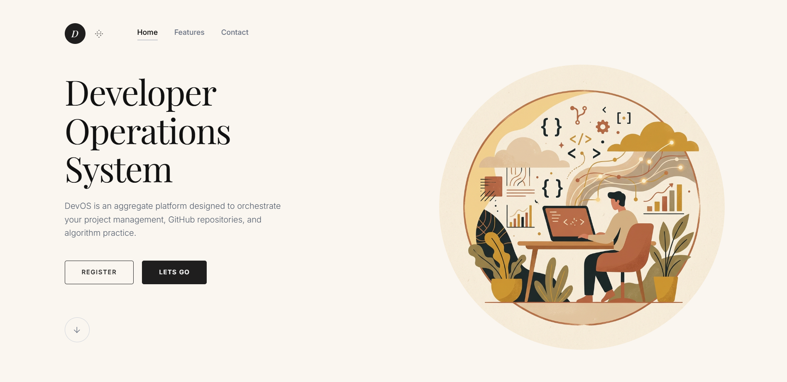
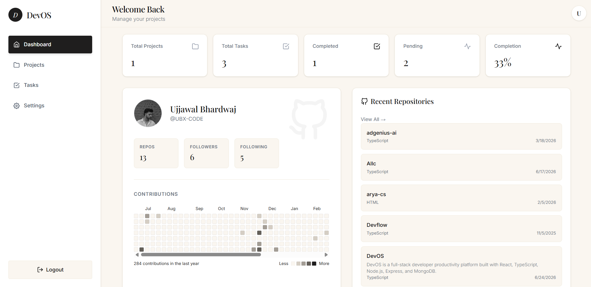
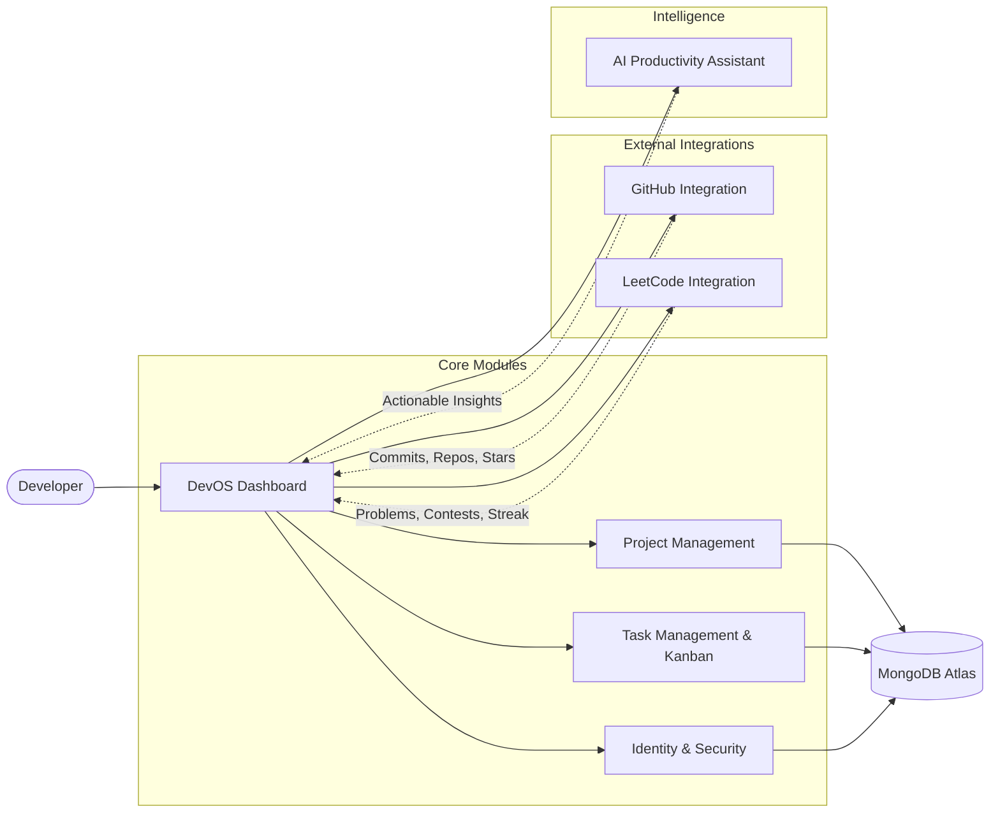

<div align="center">
  <h1 style="font-family: 'Courier New', Courier, monospace; font-weight: bold; margin-top: 20px;">
    DevOS
  </h1>

  <p align="center" style="font-family: sans-serif; color: #888;">
    <strong>The Centralized Developer Operating System</strong><br>
    Combining project management, GitHub & LeetCode analytics, and AI insights into one unified dashboard.
  </p>

  <p align="center">
    
    
    
    
    
    
  </p>
</div>

<br/>

##  Overview & Core Vision

Developers currently juggle multiple tools like GitHub, LeetCode, Notion, Trello, Google Tasks, Notes, and Resume Trackers. 

**DevOS** eliminates context switching by combining all these experiences into one modern, scalable, and production-ready application. A single pane of glass for managing your growth, work, and developer identity.

---

##  Screenshots

### Landing Page


### Developer Dashboard


---

##  Key Features

###  The Dashboard
Your daily command center built with a premium, minimalist UI inspired by Linear and Vercel.
- **Top Stats Overview:** Instantly view Total Projects, Total Tasks, Completed, Pending, and Completion Rate.
- **GitHub Integration:** Syncs your GitHub profile, showing repositories, followers, and an interactive contribution heatmap.
- **Recent Repositories:** Quick access to your top 5 recently updated GitHub repositories.
- **LeetCode Analytics:** Tracks your problem-solving journey with beautiful metrics for Easy, Medium, and Hard problems.
- **Productivity Score:** A dynamic progress bar representing your task completion rate.
- **Task Distribution Chart:** Visual breakdown of your completed vs. pending tasks via a modern Pie Chart.

###  User Authentication
A robust and secure identity system featuring fluid framer-motion animations.
- **Registration & Login:** Seamless auth flows with smooth UI transitions.
- **JWT Authentication:** Protected routes ensuring privacy.
- **Password Hashing:** Utilizing `bcrypt` for utmost security.

###  Project & Task Management
- **Lifecycle Management:** Create, Update, Delete, Archive projects.
- **Task Tracking:** Priority, Due Date, Tags, Descriptions.
- **Kanban Board:** Interactive drag-and-drop support across `Todo`, `In Progress`, `Review`, and `Done`.

---

## 🏗️ System Architecture



---

## 🛠️ Technical Architecture

### Frontend
Built for a responsive, modern, and snappy user experience.
- **Framework:** React + TypeScript
- **Styling:** Tailwind CSS, Framer Motion
- **Charts:** Recharts
- **Icons:** React Icons (Feather)
- **Routing & Fetching:** React Router, Axios

```text
DevOS-client/src/ 
 ├─ components/  # Reusable UI components (TaskStatusChart, GithubContribution, etc.)
 ├─ pages/       # Route pages (Dashboard, Login, Register, etc.)
 ├─ services/    # API integrations (GitHub, LeetCode, Backend)
 ├─ context/     # React context (AuthContext)
 └─ types/       # TypeScript interfaces
```

### Backend
Scalable and clean REST API.
- **Runtime & Framework:** Node.js, Express.js
- **Language:** TypeScript
- **Database:** MongoDB Atlas + Mongoose
- **Security:** JWT, bcrypt, CORS

```text
DevOS-server/src/
 ├─ config/      # Environment & DB setup
 ├─ controllers/ # Route handlers
 ├─ middleware/  # Auth & Validation middlewares
 ├─ models/      # Mongoose schemas
 ├─ routes/      # Express routes
 └─ services/    # Business logic
```

---

## 🎨 UI/UX Design Philosophy

Our design aesthetic is deeply inspired by modern platforms like **Linear, Notion, Vercel, and Clerk**.
- **Theme:** Modern, Minimalist, Premium, Dashboard-Focused with custom beige/dark accents (`#FAF6F0`, `#111`).
- **Features:** Clean Typography (Serif and Sans-serif pairings), Smooth Micro-Animations, Professional Cards, and No Empty Spaces.

---

## 🚀 Getting Started

1. **Clone the repository:**
   ```bash
   git clone https://github.com/UBX-CODE/DevOS.git
   cd DevOS
   ```

2. **Setup Backend:**
   ```bash
   cd DevOS-server
   npm install
   # Create a .env file with PORT, MONGO_URI, JWT_SECRET, etc.
   npm run dev
   ```

3. **Setup Frontend:**
   ```bash
   cd ../DevOS-client
   npm install
   # Create a .env file with VITE_API_URL, etc.
   npm run dev
   ```

4. **Open in Browser:**
   Navigate to `http://localhost:5173` to see DevOS in action.
